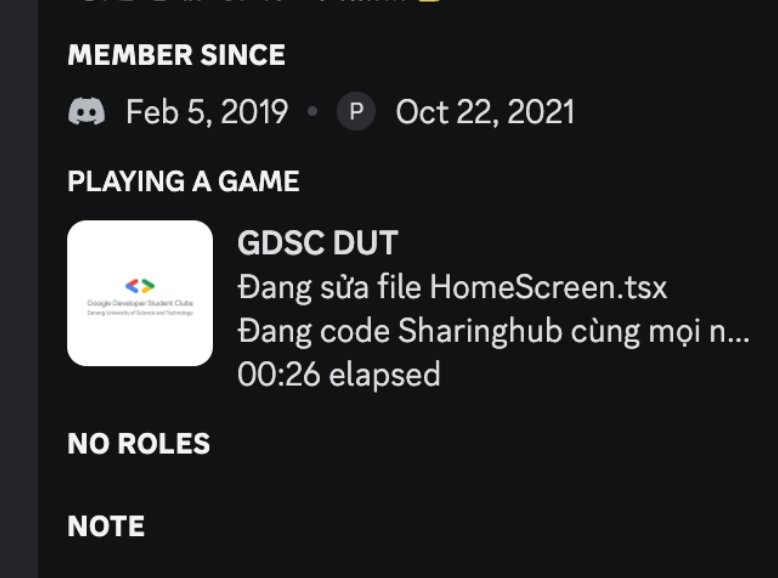

# Custom Discord Rich Presence for SharingHub Developer

### What is that?

<!-- Here is app icon placeholder -->

SharingHub - A Charity Supporting Application created by GDSC - DUT team.

> SharingHub is an app that helps you discover, join, and organize volunteer campaigns in various locations and fields. Whether you are an organizer or a participant, SharingHub provides you with a support system to make your volunteer journey easier and more enjoyable.

This project won the TOP 100 in [GDSC Solution Challenge 2023](https://developers.google.com/community/gdsc-solution-challenge).

### Feature

This extension helps you to display a Rich Present for your Discord Server like this:

